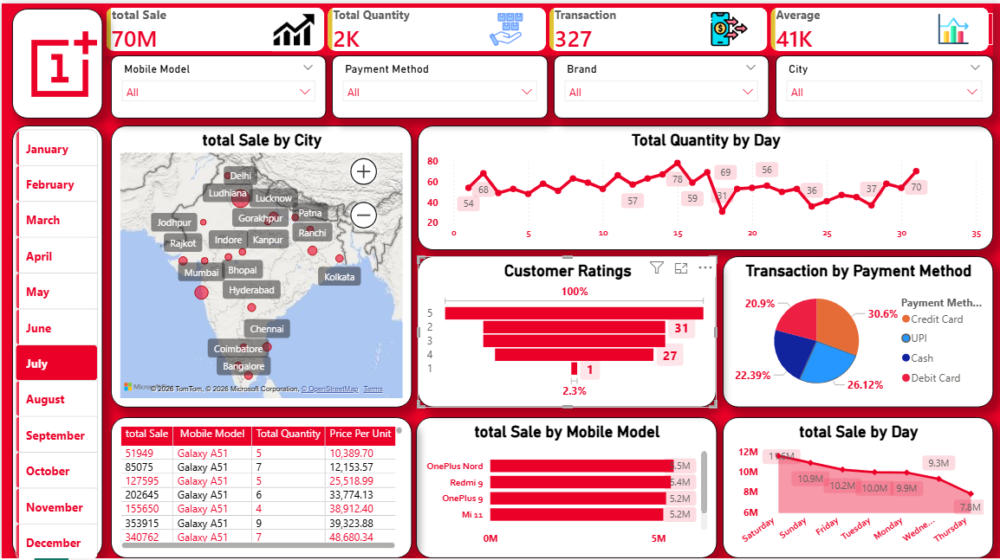

# 📊 Mobile Sales Dashboard (Power BI)

## 📸 Dashboard Preview

## 📌 Overview
This project is an interactive Mobile Sales Dashboard built using Power BI to analyze sales performance across cities, brands, and payment methods.

---
## 🎯 Key Metrics
- Total Sales: 70M+
- Total Quantity: 2K+
- Transactions: 300+
- Average Order Value: 41K

---
## 📊 Features
- City-wise sales map
- Daily sales trends
- Sales by mobile models & brands
- Customer ratings analysis
- Payment method breakdown
- Interactive filters (Month, City, Brand, Model)

---
## 🛠 Tools Used
- Power BI
- DAX
- Data Modeling

---
## 🎥 Demo
[Watch Demo on LinkedIn](https://www.linkedin.com/posts/praveen-prajapati01_powerbi-dataanalytics-dashboarddesign-ugcPost-7456542627916713984-5uFf?utm_source=share&utm_medium=member_desktop&rcm=ACoAAEXy9wQB_Xa9Wy0RyjujIgZs8Q89BAyqruk
)

---
## 📚 Learnings
- Dashboard design
- Data storytelling
- Data visualization techniques
